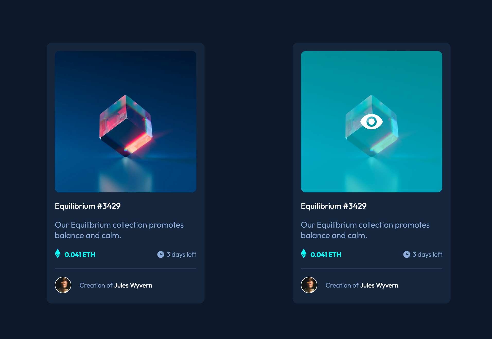

# Frontend Mentor - NFT preview card solution

This is a solution to the [NFT preview card component on Frontend Mentor](https://www.frontendmentor.io/challenges/nft-preview-card-component-SbdUL_w0U). Frontend Mentor challenges help you improve your coding skills by building realistic projects.

## Table of contents

- [The challenge](#the-challenge)
- [Screenshot](#screenshot)
- [Links](#links)

- [Built with](#built-with)

### The challenge

Solution should be as identical as possible to the desktop and mobile design.

Users should be able to:

- View the optimal layout depending on their device's screen size
- See hover states for interactive elements

### Screenshot

### Links

[Live URL](https://dainty-eclair-51ef49.netlify.app/)

### Built with

- Semantic HTML5 markup
- CCS custom properties
- CSS pseudo ::after selector
